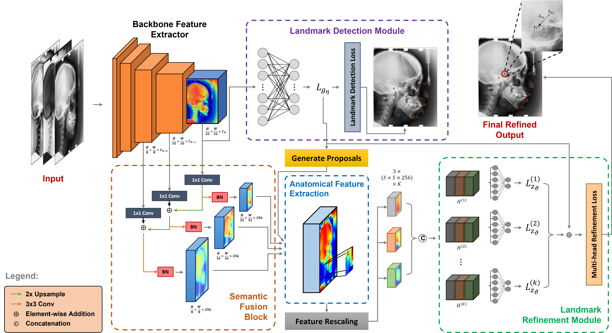

<h2 align="center">A Two-stage Regression Framework for Automated Cephalometric Landmark Detection Incorporating Semantically Fused Anatomical Features and Multi-head Refinement Loss</h2>
<p align="center">
  <a href="https://scholar.google.com/citations?hl=en&user=eTZ3L4QAAAAJ"><strong> Muhammad Anwaar Khalid </strong></a>
  ·
  <a href="https://scholar.google.com/citations?user=n1GKwfkAAAAJ&hl=en"><strong> Atif Khurshid </strong></a>
  ·
  <a href="https://scholar.google.com/citations?hl=en&user=1yHShlwAAAAJ"><strong> Kanwal Zulfiqar </strong></a>
  ·
  <a href="https://scholar.google.com/citations?hl=en&user=e2w698UAAAAJ"><strong> Ulfat Bashir </strong></a>
  ·
  <a href="https://scholar.google.com/citations?user=tpfgan0AAAAJ&hl=en"><strong> Muhammad Moazam Fraz </strong></a>
  <br>
</p>
<p align="justify">
This repository contains the implementation of <b>CEPHMark-Net</b>, a novel, end-to-end trainable two-stage regression framework for accurate cephalometric landmark detection. This work has been published in <a href="https://www.sciencedirect.com/science/article/abs/pii/S095741742401707X"><i>Expert Systems with Applications</i></a>. The framework aims to streamline the detection process and improve clinical workflows by providing precise localization of landmarks with reduced computational overhead.
</p>

<div align="center">
  
</div>
<br>
<div align="center"> Schematic of the proposed cephalometric landmark detection framework, featuring a <b>landmark detection module (LDM)</b>, <b>semantic fusion block (SFB)</b>, and <b>landmark refinement module (LRM)</b>. </div>

<h2 align="left">Overview</h2>
<p align="justify">
Cephalometric analysis plays a crucial role in orthodontic treatment planning and maxillofacial surgeries. Traditionally, this process involves manually tracing anatomical landmarks on two-dimensional (2D) radiographs, known as cephalograms.This manual process is time-consuming and subject to inter- and intra-observer variability. This repository presents state-of-the-art automatic cephalometric landmark detection framework that utilizes a novel multi-head Convolutional Neural Network (CNN). The framework consists of two primary modules: landmark detection and landmark refinement, both leveraging a shared <b><i>backbone neural network</i></b>. This backbone network functions as a feature extractor, providing rich, high-dimensional features to both modules. The <b><i>landmark detection module (LDM)</i></b> module utilizes these features to simultaneously regress coordinates for all landmarks, capturing global geometric relationships among landmarks. Our framework incorporates a cropping mechanism to extract high-dimensional features from multi-resolution feature tensors generated during the backbone network's forward pass. To effectively bridge the semantic gap between these features, we use a <b><i>semantic fusion block (SFB)</i></b> that integrates high-resolution, semantically weaker features with low-resolution, semantically richer features. This fusion yields a single, high-level feature map with fine resolution, which the <b><i>landmark refinement module (LRM)</i></b> module uses to refine the initial landmark estimates.
</p>
<h3 align="left">Key Features</h3>
<ul align="justify">
  <li> <b>Multi-head CNN Architecture:</b> A two-stage regression framework with a shared backbone feature extractor across two integrated modules.
  <li> <b>End-to-end Trainable:</b> A unified architecture enabling simultaneous detection and refinement, making the system efficient and scalable.
  <li> <b>Semantic Fusion Block:</b> Integrates high- and low-resolution features to capture both global geometric relations and local tissue characteristics.
  <li> <b>Real-time Inter-model Communication:</b> Enables the system to learn from and correct each module's predictions, boosting overall accuracy.
  <li> <b>Multi-head Refinment Loss:</b> Aggregates predictions from multiple CNN heads, each specializing in different aspects of landmark detection.
</ul>

## Installatoin
### Prerequisites
- Python 3.8
- TensorFlow 2.10
- OpenCV 4.9
### Steps
1. Clone the repository:
   ```bash
   git clone https://github.com/manwaarkhd/CEPHMark-Net.git
   cd CEPHMark-Net
   ```
3. Set up a Python virtual environment (optional but recommended):
   ```bash
   python3 -m venv pyenv
   source pyenv/bin/activate  # On Windows use `env\Scripts\activate`
   ```
5. Install the required packages:
   ```bash
   pip install -r requirements.txt
   ```

## Dataset
We utilized the publicly available [ISBI 2015 Dataset](https://ieeexplore.ieee.org/iel7/42/4359023/07061486.pdf?casa_token=Wv4hnXcVbf4AAAAA:eIQCBU1Y_6s0H9s1WXZk-c30fQQq-B7_nz-ADloTje8WqKzfZPE_7TXpaCxSob5L0CqG9F8rpkvk) by Wang et al. (2015), which consists of 400 high-resolution X-ray images. Each image has spatial dimensions of 1935 × 2400 pixels, with a spatial resolution of 0.1 mm/pixel in both directions. We employed the same 150 images for training as used in the ISBI Grand Challenge 2015. The remaining 250 images are reserved for evaluation and further partitioned into two distinct subsets: Test1 and Test2. Test1 serves as our validation set for assessing the accuracy of our method during the development phase, and Test2 is used as our test set for the final evaluation of our proposed method. <br>
After downloading the files, please create a folder named `datasets` and organize it as follows:
```
datasets/
└── ISBI Dataset/
    ├── Dataset/
    │   ├── Training/
    │   │   ├── 001.bmp
    │   │   ├── 002.bmp
    │   │   └── ...
    │   └── Testing/
    │       ├── Test1/
    │       │   ├── 151.bmp
    │       │   ├── 152.bmp
    │       │   └── ...
    │       └── Test2/
    │           ├── 301.bmp
    │           ├── 302.bmp
    │           └── ...
    └── Annotations/
        ├── Junior Orthodontist/
        │   ├── 001.txt
        │   ├── 002.txt
        │   ├── ...
        │   └── 400.txt
        └── Senior Orthodontist/
            ├── 001.txt
            ├── 002.txt
            ├── ...
            └── 400.txt
```

## Usage
### Preparing the Data
1. Download the dataset from [link](https://figshare.com/s/37ec464af8e81ae6ebbf).
2. Organize the dataset as shown in the Datset section above.
3. Ensure that annotation files are placed correctly within the `Annotations` directory.

### Configuration:
The configuration of the CEPHMark-Net framework is managed through the `config.py` file. This file contains various settings, hyper-parameters, and heuristics that can be adjusted to fine-tune the model's performance and adapt it to different datasets. To customize the configuration for your specific use case, edit the `config.py` file accordingly. Here are some common modifications you might consider:
- **Adjusting Image Dimensions:** If your dataset has different image dimensions, modify **`config.ORIGINAL_HEIGHT`**, **`config.ORIGINAL_WIDTH`**.
- **Region of Interest (ROI) Pooling:** Adjust the size of the pooling region used for extracting features from the detected regions by **`config.ROI_POOL_SIZE`**.
- **Updating Training Parameters:** Modify **`config.TRAIN.EPOCHS`** and **`config.TRAIN.OPTIMIZER`** to set the number of training epochs and choose a different optimizer or learning rate.

### Training
To train the model on `Train` dataset, use:
```bash
python train.py
```
### Validation
To run inference on `Test1` dataset using pre-trained weights:
```bash
python valid.py
```
### Testing
To evaluate the model on the `Test2` dataset:
```bash
python test.py
```

## Results
For a comprehensive analysis of the results, including quantitative metrics such as mean squared error (MSE) and landmark detection accuracy, as well as qualitative comparisons with traditional methods and other state-of-the-art approaches, please refer to our [paper](https://www.sciencedirect.com/science/article/abs/pii/S095741742401707X). The paper provides detailed tables, charts, and visualizations illustrating the performance improvements and validation of our method.

## Citation
If you find our work useful in your research, please consider citing our paper:
```BibTeX
@article{khalid2024two,
  title={A two-stage regression framework for automated cephalometric landmark detection incorporating semantically fused anatomical features and multi-head refinement loss},
  author={Khalid, Muhammad Anwaar and Khurshid, Atif and Zulfiqar, Kanwal and Bashir, Ulfat and Fraz, Muhammad Moazam},
  journal={Expert Systems with Applications},
  pages={124840},
  year={2024},
  publisher={Elsevier}
}
```

